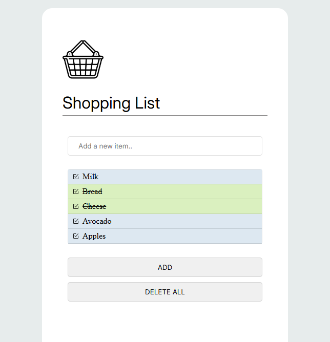

# Shopping List

Simple React application designed to manage everyday shopping tasks.

## Built With

## Features

- **Add items** — quickly add items to your shopping list.
- **Mark as bought** — mark items as completed.
- **Delete all** — remove all items from the list with one click.

